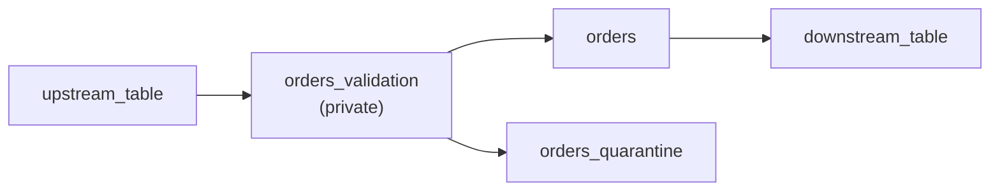

# Project Configuration

This guide explains how to configure your Kelp project using the `kelp_project.yml` file. It covers project paths, configuration hierarchies, variable management, environment targets, and specialized configurations like quarantine and catalog sync settings.

## Project File Location

The main configuration file is `kelp_project.yml`, typically located at the project root:

```
my_project/
├── kelp_project.yml           # ← Main configuration file
├── kelp_metadata/
│   ├── models/
│   ├── metrics/
│   ├── functions/
│   └── abacs/
└── src/
    └── transformations/
```

Kelp auto-discovers `kelp_project.yml` by searching up to 3 levels in your directory hierarchy. You can also specify the path explicitly:

```python
from kelp import init

ctx = init("./custom/path/kelp_project.yml")
```

## Basic Structure

```yaml
kelp_project:
  # Metadata paths
  models_path: "./kelp_metadata/models"
  metrics_path: "./kelp_metadata/metrics"
  functions_path: "./kelp_metadata/functions"
  abacs_path: "./kelp_metadata/abacs"

  # Configuration hierarchies with + inheritance
  models:
    +catalog: ${ catalog }
    +schema: ${ default_schema }

  metric_views:
    +catalog: ${ catalog }
    +schema: ${ metric_schema }

  functions:
    +catalog: ${ function_catalog }
    +schema: ${ function_schema }

  abacs: {}

# Global variables
vars:
  catalog: my_catalog
  default_schema: core
  metric_schema: metrics
  function_catalog: security
  function_schema: funcs

# Environment-specific overrides
targets:
  dev:
    vars:
      catalog: my_catalog_dev
      default_schema: core_dev

  prod:
    vars:
      catalog: my_catalog_prod
      default_schema: core_prod
```

## Project Paths

Define where Kelp looks for metadata files:

```yaml
kelp_project:
  models_path: "./kelp_metadata/models"
  metrics_path: "./kelp_metadata/metrics"
  functions_path: "./kelp_metadata/functions"
  abacs_path: "./kelp_metadata/abacs"
```

**Path Resolution:**

- Paths are relative to `kelp_project.yml` directory
- Kelp recursively discovers all YAML files in these directories
- Use subdirectories for organization (e.g., `models/silver/`, `models/gold/`)

## Configuration Hierarchies

Configuration hierarchies use the `+` prefix to provide defaults that are inherited by all objects in a scope.

### Basic Hierarchy

Apply catalog to all models:

```yaml
kelp_project:
  models_path: "./kelp_metadata/models"
  models:
    +catalog: analytics_catalog
```

All models will inherit `catalog: analytics_catalog` unless they override it.

### Nested Hierarchies

Create sub-hierarchies for different domains:

```yaml
kelp_project:
  functions_path: "./kelp_metadata/functions"
  functions:
    +catalog: ${ function_catalog }
    +schema: ${ default_schema }
    public:
      +schema: ${ public_schema }
    security:
      +schema: ${ security_schema }
    masked:
      +catalog: ${ masked_catalog }
      +schema: ${ masked_schema }
```

This creates multiple groupings with different defaults:

- Functions in `public/` inherit `function_catalog` and `public_schema`
- Functions in `security/` inherit `function_catalog` and `security_schema`
- Functions in `masked/` inherit `masked_catalog` and `masked_schema`

### Multi-Layer Defaults

Combine hierarchical levels for flexible configuration:

```yaml
kelp_project:
  models_path: "./kelp_metadata/models"
  models:
    +catalog: ${ data_catalog }           # All models
    +tags:
      kelp_managed: ""                    # All models
    bronze:
      +schema: kelp_bronze                # bronze/* models
    silver:
      +schema: kelp_silver                # silver/* models
      +tags:
        quality_checked: ""               # silver/* models
    gold:
      +schema: kelp_gold                  # gold/* models
      +column_tag_mode: replace           # gold/* models
```

## Variables and Interpolation

Variables enable environment-specific configuration without changing YAML files.

### Define Variables

```yaml
vars:
  # Catalog names
  data_catalog: analytics_prod
  function_catalog: security_prod
  metric_catalog: analytics_prod

  # Schema names
  bronze_schema: bronze
  silver_schema: silver
  gold_schema: gold

  # Paths and formats
  retention_days: 30
  partition_column: load_date
```

### Use Variables

Reference variables with `${ variable_name }` syntax (Jinja2 style):

```yaml
kelp_project:
  models:
    +catalog: ${ data_catalog }
    bronze:
      +schema: ${ bronze_schema }
    silver:
      +schema: ${ silver_schema }

kelp_models:
  - name: customers
    catalog: ${ data_catalog }
    schema: ${ silver_schema }
    # ...
```

### Variable Interpolation

Variables are interpolated recursively:

```yaml
vars:
  workspace: production
  catalog: workspace_${ workspace }       # Evaluates to workspace_production
  schema: ${ catalog }_data               # Evaluates to workspace_production_data

kelp_project:
  models:
    +catalog: ${ catalog }                # Uses workspace_production
```

## Environment Targets

Use targets to manage configurations for different environments (dev, staging, prod).

### Define Targets

```yaml
targets:
  dev:
    vars:
      data_catalog: analytics_dev
      function_catalog: security_dev
      function_schema: funcs_dev

  staging:
    vars:
      data_catalog: analytics_staging
      function_catalog: security_staging

  prod:
    vars:
      data_catalog: analytics_prod
      function_catalog: security_prod
```

### Use Targets

Specify target when initializing:

```python
from kelp import init

# Use dev environment
ctx = init(target="dev")

# Use prod environment
ctx = init(target="prod")

# Override variables for specific target
ctx = init(target="staging", overwrite_vars={"data_catalog": "custom_catalog"})
```

### CLI Target Usage

```bash
# Validate dev configuration
uv run kelp validate --target dev

# Validate prod configuration
uv run kelp validate --target prod
```

## Quarantine Configuration

Configure how Kelp handles data quality failures and quarantine tables.

### Basic Quarantine Setup

```yaml
kelp_project:
  quarantine_config:
    quarantine_catalog: null              # Use default catalog
    quarantine_schema: quarantine         # Store quarantine tables here
    quarantine_prefix: ""
    quarantine_suffix: _quarantine        # Suffix for quarantine tables
    validation_prefix: ""
    validation_suffix: _validation        # Suffix for validation tables
```

### Custom Naming

Control quarantine and validation table naming:

```yaml
kelp_project:
  quarantine_config:
    quarantine_catalog: quality_checks_catalog
    quarantine_schema: failed_records
    quarantine_prefix: qtn_                # Prefix for quarantine tables
    quarantine_suffix: ""
    validation_prefix: val_                # Prefix for validation tables
    validation_suffix: ""
```

With this configuration, `expect_all_or_quarantine` on table `customers` creates:

- `quality_checks_catalog.failed_records.val_customers` - Validation results
- `quality_checks_catalog.failed_records.qtn_customers` - Quarantined records

### Quarantine Flow

When a table uses `expect_all_or_quarantine`:

```yaml
kelp_models:
  - name: orders
    quality:
      engine: sdp
      expect_all_or_quarantine:
        valid_amount: amount > 0
        valid_status: status IN ('pending', 'completed')
```

Kelp creates this flow:



- **upstream** → Reads from source
- **orders_validation** → Applies expectations, routes good data to table, bad data to quarantine
- **orders_quarantine** → Holds failed records for investigation
- **orders** → Final good data

## Remote Catalog Synchronization

Configure how Kelp syncs metadata with your Databricks Unity Catalog.

### Sync Modes

```yaml
kelp_project:
  remote_catalog_config:
    # Tag synchronization modes
    table_tag_mode: "replace"             # append, replace, or managed
    column_tag_mode: "replace"
    table_property_mode: "append"

    # Managed keys - only these are synced in managed mode
    managed_table_tags: []
    managed_column_tags: []
    managed_table_properties: []
```

### Append Mode

Adds or updates tags/properties but never removes existing ones:

```yaml
table_tag_mode: "append"
```

**Effect:** If tag exists locally, update it. If tag exists remotely but not locally, leave it alone.

**Use case:** When other systems also manage tags (e.g., governance tools).

### Replace Mode

Replaces all tags with those defined locally:

```yaml
table_tag_mode: "replace"
column_tag_mode: "replace"
```

**Effect:** Remote tags become exactly what's defined locally. Removes remote tags not in local config.

**Use case:** When Kelp is the source of truth for tags.

### Managed Mode

Manage only specific keys:

```yaml
table_tag_mode: "managed"
managed_table_tags:
  - "kelp_managed"
  - "quality_level"
  - "pii_classification"
```

**Effect:** Only manage listed tag keys. Leave all other tags untouched.

**Use case:** Teams sharing tag management (Kelp manages certain tags, other systems manage others).

### Example Configuration

```yaml
kelp_project:
  remote_catalog_config:
    # Tags: Kelp is source of truth
    table_tag_mode: "replace"
    column_tag_mode: "replace"

    # Properties: Append only (other systems may set properties)
    table_property_mode: "append"
    managed_table_properties: []

    # Exclude certain properties from syncing
    managed_table_properties:
      - "kelp_owner"
      - "kelp_domain"
```

## Metadata Governance Policies

Kelp can enforce governance standards on your local YAML metadata via a separate policy system. When enabled, policies are evaluated on every `kelp init()` call and on demand via `kelp check-policies`.

> **Note:** Policy checks operate on your **local YAML metadata** — they do not connect to Unity Catalog.

### Enabling Policies

Set `policies_path` to point at your policy YAML files, then flip the master switch:

```yaml
kelp_project:
  policies_path: "./kelp_metadata/policies"
  policy_config:
    enabled: true
```

`policy_config` only carries the global `enabled` flag. All governance rules (required descriptions, tags, naming patterns, etc.) are defined in separate **policy YAML files** under `policies_path`.

### Policy YAML Files

Policy files use the `kelp_policies` key and scope rules to models via glob patterns:

```yaml
# kelp_metadata/policies/data_standards.yml
kelp_policies:
  - name: bronze_standards
    applies_to: "bronze/*"          # Matches models in the bronze/ subdirectory
    model:
      require_description: true
      require_tags:
        - owner
      severity: warn
    column:
      require_description: true
      severity: error

  - name: global_fallback
    applies_to: "*"                 # Catch-all for any other models
    model:
      require_description: true
      severity: warn
```

See the [Governance Policies](policies.md) guide for the full rule reference and advanced patterns.

## Complete Example

Here's a complete `kelp_project.yml` with all sections:

```yaml
# yaml-language-server: $schema=./kelp_json_schema.json

kelp_project:
  # Metadata paths
  models_path: "./kelp_metadata/models"
  metrics_path: "./kelp_metadata/metrics"
  functions_path: "./kelp_metadata/functions"
  abacs_path: "./kelp_metadata/abacs"

  # Models configuration with hierarchies
  models:
    +catalog: ${ data_catalog }
    +tags:
      kelp_managed: ""
      environment: ${ environment }
    bronze:
      +schema: bronze
      +tags:
        layer: raw_data
    silver:
      +schema: silver
      +tags:
        layer: transformed
        quality_checked: ""
    gold:
      +schema: gold
      +tags:
        layer: analytics

  # Metrics configuration
  metrics_path: "./kelp_metadata/metrics"
  metric_views:
    +catalog: ${ data_catalog }
    +schema: metrics
    +tags:
      kelp_managed: ""

  # Functions configuration
  functions_path: "./kelp_metadata/functions"
  functions:
    +catalog: ${ function_catalog }
    public:
      +schema: public_funcs
    security:
      +schema: security_funcs
      +catalog: ${ security_catalog }

  # ABAC policies configuration
  abacs_path: "./kelp_metadata/abacs"
  abacs: {}

  # Quarantine and validation table configuration
  quarantine_config:
    quarantine_catalog: null
    quarantine_schema: quality
    quarantine_prefix: ""
    quarantine_suffix: _quarantine
    validation_prefix: ""
    validation_suffix: _validation

  # Remote catalog sync configuration
  remote_catalog_config:
    table_tag_mode: "replace"
    column_tag_mode: "replace"
    table_property_mode: "append"
    managed_table_tags: []
    managed_column_tags: []
    managed_table_properties: []

  # Metadata governance policies (rules live in kelp_metadata/policies/)
  policies_path: "./kelp_metadata/policies"
  policy_config:
    enabled: false

# Global variables
vars:
  environment: production
  data_catalog: analytics
  function_catalog: transformations
  security_catalog: security
  bronze_schema: bronze
  silver_schema: silver
  gold_schema: gold

# Environment-specific configurations
targets:
  dev:
    vars:
      environment: development
      data_catalog: analytics_dev
      function_catalog: transformations_dev
      security_catalog: security_dev

  staging:
    vars:
      environment: staging
      data_catalog: analytics_staging
      function_catalog: transformations_staging
      security_catalog: security_staging

  prod:
    vars:
      environment: production
      data_catalog: analytics_prod
      function_catalog: transformations_prod
      security_catalog: security_prod
```

## Loading Configuration

### Python API

```python
from kelp import init, get_context

# Auto-discover and load with dev target
ctx = init(target="dev")

# Load with custom path
ctx = init(config_path="./config/kelp_project.yml", target="prod")

# Override variables
ctx = init(
    target="prod",
    overwrite_vars={"data_catalog": "custom_catalog"}
)

# Access configuration
print(ctx.project_settings.models_path)
print(ctx.runtime_vars)
```

### CLI

```bash
# Validate with dev target
uv run kelp validate --target dev

# Validate with custom config path
uv run kelp validate -c ./config/kelp_project.yml --target prod
```

## Best Practices

1. **Use variables for environment values** - Never hardcode catalog/schema names.

2. **Organize hierarchies by layer** - Use `+schema` defaults for bronze/silver/gold organization.

3. **Tag strategically** - Use `+tags` hierarchies for consistent tagging across layers.

4. **Separate concerns** - Keep functions, models, metrics, and ABAC policies in separate paths.

5. **Test targets before deploy** - Always validate target configurations before production deployment.

6. **Version control config** - Commit `kelp_project.yml` to git for reproducibility.

7. **Document custom settings** - Add comments explaining non-obvious configuration choices.

8. **Use managed mode for shared tags** - When multiple systems manage tags, use `managed` mode.

9. **Consider catalog separation** - Use different catalogs for different sensitivity levels (data, security, metrics).

10. **Review sync settings** - Ensure `remote_catalog_config` matches your governance requirements.

## See Also

- [CLI Reference](cli.md) - Command-line tool usage
- [Functions](functions.md) - Defining functions with catalog/schema inheritance
- [Transformations](transformations.md) - Using configuration in transformations
- Configuration Reference - Configuration YAML keys
