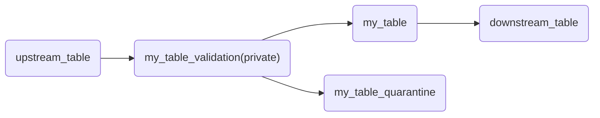

# Spark Declarative Pipelines (SDP)

This guide provides an overview of how to integrate Kelp with Databricks Spark Declarative Pipelines (SDP). It covers the initialization of Kelp in an SDP environment, using decorators for defining pipeline components, implementing quality checks, and utilizing the low-level API for more control over your pipelines.


## Initialize Kelp in SDP

### Spark Configurations

Kelp autodetects project and target configurations from Spark configurations. You can set these in your pipeline configurations.


```yaml
# databricks.yml
# ...
variables:
    kelp_project_file:
        description: Path to kelp project file
        default: ${workspace.file_path}/src/kelp_project_etl/kelp_project.yml
# ...
```

```yaml
# pipeline.yml
resources:
  pipelines:
    kelp_sample_sdp:
      name: kelp_sample_sdp
      # ...
      configuration:
        kelp.project_file: ${var.kelp_project_file}
        kelp.target: ${bundle.target}
      environment:
        dependencies:
          - kelp-py==0.1.0
          - databricks-labs-dqx
      # ...
```

### Explicit initialization in code

You can also explicitly initialize Kelp in your code, for example in a Python file that is part of your pipeline. This can be useful if you want to have more control over the initialization process.

Be aware that you have to set the `init` in each file to guarantee that Kelp is properly initialized in all situations (e.g. when partially running a pipeline).

```python
import kelp.pipelines as kp

kp.init("<path to kelp_project.yml>", target="<target>")

@kp.table
def my_table():
    # ...
```


## Use Kelp Decorators in SDP

Kelp provides decorators that wrap around the built-in SDP decorators to auto-inject the parameters defined in your metadata files.

Function names and decorator arguments are used to find the corresponding model definitions in your `kelp_metadata/models` directory. This allows you to keep your pipeline code clean and focused on the logic, while Kelp handles the configuration and metadata management.

```yaml
kelp_models:
  - name: my_table
    #... 

```

```python
import kelp.pipelines as kp

@kp.table # (1)!
def my_table():
    # ...

@kp.table(name="my_table") # (2)!
def different_name():
    # ...
```

1. This will use the function name to search for the corresponding model definition in your `kelp_metadata/models` directory.

2. This will use the provided name to search for the corresponding model definition in your `kelp_metadata/models` directory.


You can exclude parameters from being auto-injected through `exclude_params`. This allows you to have more control over the parameters that are passed to your pipeline components. For example, if you want to exclude the `schema` parameter to not set the Spark Schema by SDP.

```python
import kelp.pipelines as kp

@kp.table(exclude_params=["schema"])
def my_table():
    # ...
```

## Pass parameters without decorators

Since Spark Declarative Pipelines (SDP) is under fast development which may change syntax or put extra parameters in the decorated functions, Kelp provides a low-level API to pass parameters without using decorators. This allows you to have more control over the parameters that are passed to your pipeline components and makes your code more resilient to changes in SDP.

```python
from pyspark import pipelines as dp
import kelp.pipelines as kp

@dp.table(**kp.params("my_table"))
def my_table():
    # ...

@dp.table(**kp.params("my_table", exclude=["schema"])) #! (1)
def my_table_no_schema():
    # ...

```


1. You may also exclude parameters when using the low-level API, just like with the decorators.

## Quality Checks and Quarantine
Kelp's quality checks can be easily integrated into your SDP pipelines. You can define your quality checks in your models and then use them in your pipeline code. Kelp will automatically run the quality checks after the corresponding pipeline component is executed.

### SDP Expectations

```yaml
kelp_models:
  - name: my_table
    # ...
    quality:
      engine: sdp
      expect_all: 
       "key": "expectation"
      expect_all_or_fail: ...
      expect_all_or_drop: ...
      expect_all_or_quarantine: ...
```

When you use `expect_all_or_quarantine`, Kelp will automatically quarantine the data if any of the expectations fail. You can then choose to investigate and fix the issues with the data before allowing it to be used in downstream pipeline components.
This would generate the following SDP-Chart



### DQX Checks

A similar approach can be taken for DQX checks, where you define your DQX checks in your model metadata and Kelp will automatically run them in your pipeline.

Since DQX checks are applied on the code level you can also set the expectation level and quarantine pattern for each table in your model metadata. This allows you to have more control over how the quality checks are applied and how the data is handled when checks fail.

The `sdp_expect_level` can be set to `warn`, `fail`, `drop` which correspond to the different expectation decorators in SDP. You can deactivate the expectation by setting it to `deactivate`.

Setting `sdp_quarantine` to `true` will enable the quarantine pattern for this table, which will automatically quarantine the data if any of the DQX checks fail. This will generate the same SDP-Chart as shown above for the `expect_all_or_quarantine` example, but with the DQX checks being applied in the validation step.

```yaml
kelp_models:
  - name: my_table
    # ...
    quality:
      engine: dqx
      sdp_expect_level: warn #! (1)
      sdp_quarantine: true #! (2)
      checks:
        - check:
            function: is_in_list
            arguments:
              column: order_state
              allowed:
                - ...
```
1. This will append an SDP expectation to the pipeline with the corresponding level. 
2. This will enable the quarantine pattern for this table.


## Using ref() and target() functions in SDP

You can also also use the `ref()` and `target()` functions to develop your upstream and downstream pipeline components.
This is useful to reduce the need for passing catalog and schema configurations in your pipeline code, as Kelp will auto-resolve these based on the model metadata.
If you use a quarantine-pattern `target` will auto-resolve to the validation table.

```python
import kelp.pipelines as kp
from pyspark import pipelines as dp


@kp.create_streaming_table("my_table")

@dp.append_flow(target = kp.target("my_table"),)
def upstream_flow():
  #...

@kp.table
def downstream_table():
    df = spark.readStream.table(kp.ref("my_table"))
    # ...
```

## Create Streaming Table Function

You can also create streaming tables by using the `create_streaming_table` wrapper-function or by using the low-level API `params_cst()`. The same rules for auto-injecting parameters and excluding parameters apply to streaming tables as well.

Both also inject the SDP expectation quality checks if they are defined in the model metadata.

```python
import kelp.pipelines as kp

kp.create_streaming_table("my_streaming_table")

# or using low-level API
from pyspark import pipelines as dp

dp.create_streaming_table(**kp.params_cst("my_streaming_table"))
``` 

## Applying catalog metadata to SDP tables

Currently SDP does not have full built-in support for catalog metadata like tags or if you which to omit the spark-schema you also can't apply descriptions to your columns. Kelp provides a workaround for this by applying the catalog metadata in a separate step in your Lakeflow Job.

```yaml
kelp_models:
  - name: my_table
    # ...
    columns:
      column1:
        description: This is column 1
        tags:
          - tag1 : "" #! (1)
          - tag2 : "value"
```

1. This will apply the tag `column_tag1` with an empty value to `column1` in the catalog.


Go to [here catalog sync docs]
