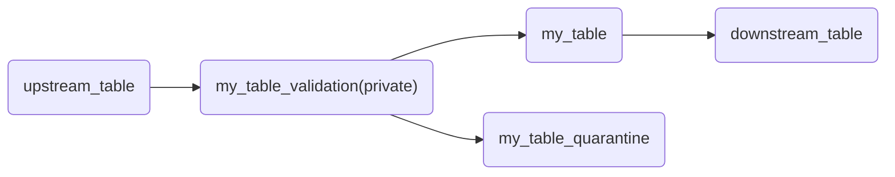

# Kelp SDP Pipelines

This reference provides an overview of how to build Spark Declarative Pipelines (SDP) using Kelp metadata. It covers the key concepts, components, and best practices for leveraging Kelp in your SDP projects.

## Considerations

If any other SDP related skills are provided use this reference to extend the provided instructions on how to build and manage SDP pipelines in general.

## Main Kelp Assets

- **Sources**: Define the input data for your pipelines, including tables, files, or other data sources.
- **Models**: Configure the parameters passed to the declarative pipeline definitions. They can be used to create tables in your pipeline.

## Kelp Pipeline Configuration

Beside the kelp-project structure, kelp needs to get configured in the pipeline definition. Kelp will use this to know where to find the metadata and which target to use.

How to configure Kelp in your DAB pipeline definition:
```yaml
resources:
  pipelines:
    kelp_sample_sdp:
      name: kelp_sample_sdp
      ## ...

      # Defining Kelp configuration for the pipeline
      configuration:
        kelp.project_file: ${var.kelp_project_file}
        kelp.target: ${bundle.target}
      ## Kelp dependency needs to be added to the pipeline dependencies
      environment:
        dependencies:
          - ${var.kelp_dependency}
``` 

## Passing Parameters from Kelp Metadata to SDP

Kelp allows you to inject parameters from your metadata (models, sources) into your Spark Declarative Pipeline definitions. This enables dynamic and flexible pipeline configurations based on your metadata. Kelp will automatically resolve the parameters defined in your models and sources and make them available for use in your SDP definitions. A main benefit is that Kelp also resolves catalog and schema information from the metadata, so you don't need to configure them in each pipeline code.

### Direct Parameter Injection (Recommended)

You can directly reference the parameters defined in your Kelp models and sources within your SDP decorators. This makes the implementation robust against any future api changes in the SDP library, not yet implemented by Kelp. 

```python
from pyspark import pipelines as dp
from pyspark.sql import SparkSession
from kelp import pipelines as kp

spark = SparkSession.active()

@dp.table(
    **kp.params("gold_orders_customers_with_params"),
)
def gold_orders_customers_with_params():
    # Your transformation logic here
    return df
```

You can also exclude parameters, mainly useful for not enforcing column-schema on the target table.

```python
kp.params("gold_orders_customers_with_params", exclude=["schema"])
```

For the `dp.create_streaming_table()` function use `kp.params_cst()` this also injects expectations except quarantine.

```python
dp.create_streaming_table(**kp.params_cst("bronze_orders_streaming"))
```

### Kelp Decorators
Kelp also provides decorators that can be used in conjunction with the SDP decorators to inject parameters from your Kelp metadata.
Only use decorators if the project mainly uses Kelp Decorators or you need to implement a quarantine pattern.

The decorator will:
- Auto resolve Kelp model name by function name
- Apply expecations defined in the model configuration (if any)
- Apply quarantine pattern, if quarantine expectations are defined

```python
from pyspark.sql import SparkSession
from kelp import pipelines as kp

spark = SparkSession.active()

@kp.table(exclude_params=["schema"])
def bronze_customers():
    """
    Bronze transformation for customers. Reads from the source_customers temporary view and writes to the bronze layer.
    """
    return spark.readStream.table("source_customers")
```

## Sources
Sources represent the input data for the Spark project. They are defined in the `kelp_metadata/sources` directory and can include properties such as the format of the source data.
The kp.source() will auto resolve the source path for tables or volumes injecting the correct catalog and schema per target.

```python
@dp.temporary_view
def source_customers():
    """
    Reads the raw sample customers data from the landing volume.
    """
    path = kp.source("landing_volume_customers")
    options = kp.source_options("landing_volume_customers")

    return spark.readStream.format("cloudFiles").options(**options).load(path)
```

## Quality Expectations and Quarantine Pattern
Kelp allows you to define quality expectations in your model configurations.
You can define SDP or DQX expectations in the model configuration and Kelp will automatically apply them when you use the `kp.params_cst()` function or the `@kp.table` decorator. If you have defined quarantine expectations, Kelp will also automatically implement the quarantine pattern in your pipeline when using `@kp.table`. Preffer SDP expectations for better integration in the SDP ecosystem. Use DQX if instructed or mainly used in other models.

### SDP Expectations

```yaml
kelp_models:
  - name: my_table
    # ...
    quality:
      engine: sdp
      expect_all: 
       "key": "expectation"
      expect_all_or_fail: ...
      expect_all_or_drop: ...
      expect_all_or_quarantine: ...
```

### DQX Expectations

```yaml
kelp_models:
  - name: my_table
    # ...
    quality:
      engine: dqx
      sdp_expect_level: warn # (1)!
      sdp_quarantine: true # (2)!
      checks:
        - check:
            function: is_in_list
            arguments:
              column: order_state
              allowed:
                - ...
```
1. This will append an SDP expectation to the pipeline with the corresponding level.
2. This will enable the quarantine pattern for this table.


### Quarantine pattern example



## Using ref() and target() functions in SDP

You can also use the `ref()` and `target()` functions to develop your upstream and downstream pipeline components.
This reduces the need to pass catalog and schema configurations in your pipeline code, as Kelp will auto-resolve these based on the model metadata.
If you use a quarantine pattern, `target` will auto-resolve to the validation table.

```python
@dp.create_streaming_table("my_table")

@dp.append_flow(target = kp.target("my_table"),)
def upstream_flow():
  #...

@kp.table
def downstream_table():
    df = spark.readStream.table(kp.ref("my_table"))
    # ...
```
